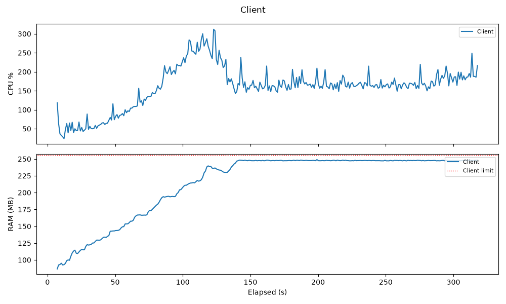
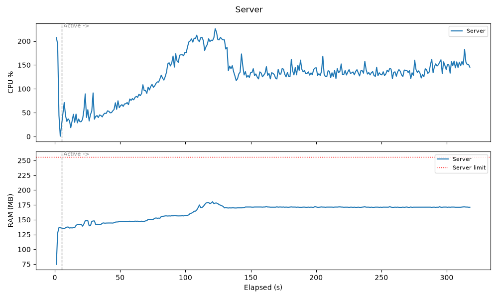

# REGISTRATION SYSTEM

## Build & Config & Run

### Test & Build 

#### Compile
```bash
mvn clean compile
```

#### Test
```bash
mvn clean test
```

#### Build 
```bash
mvn clean package
```

#### Build Docker image
```bash
sh build-images.sh
```

#### Config

Có thể config thông qua flags hoặc trong application.properties trong môi trường dev

Client

|Tham số | Mặc định | ràng buộc               | Ý nghĩa |
|---|---|-------------------------|---|
| server-host | localhost |                         | Host TCP của Server |
| server-port | 9000 |                         | Port TCP của Server |
| mode | normal | `normal` \| `benchmark` | Chạy 1 Client vô hạn (Normal) hay N Client theo Load Profile (Benchmark) |
| simulated-clients | 1 | \>= 1                   | Số Simulated Client (chỉ có ý nghĩa ở Benchmark Mode) |
| register-rate-per-second | 10 | \> 0                    | Tốc độ ramp-up REGISTER (Benchmark Mode) |
| benchmark-duration-seconds | 60 | \>= 1                   | Thời gian Benchmark Mode chạy trước khi tự dừng |
| assumed-validity-period-seconds | 60 |                         | Validity Period giả định dùng khi response `ALREADY_REGISTERED` không mang giá trị thật |
| renewal-window-min-percent | 60 | 0 <= min < max          | Cận dưới % của Validity Period để chọn thời điểm Renew tiếp theo |
| renewal-window-max-percent | 90 | max <= 99               | Cận trên % tương ứng |
| timeout-millis | 2000 | \> 0                    | Timeout socket cho mỗi lần thử gọi |
| max-retries | 3 | \>= 0                   | Số lần retry tối đa mỗi lệnh gọi |
| retry-base-delay-millis | 200 | \>= 0                   | Base delay cho exponential backoff + jitter giữa các lần retry |
| auth-private-key | (khoá demo Ed25519, base64) |                         | Nửa private của Shared Signing Key — phải khớp `authPublicKey` phía Server |
| otel.exporter.otlp.endpoint | http://localhost:4317 |                         | Endpoint OTLP gRPC của Collector (không thuộc `ClientProperties`, cấu hình riêng ở `OtelLogging`) |

Server

|Tham số | Mặc định | ràng buộc | Ý nghĩa |
|---|---|---|---|
| registration.tcp-port | 9000 | | Port TCP nhận REGISTER/RENEW/CANCEL từ Client |
| registration.validity-period-seconds | 60 | | Validity Period cấp cho mỗi Registration khi REGISTER/RENEW thành công |
| registration.reaper-interval-millis | 300000 (5 phút) | | Chu kỳ quét của reaper xoá bản ghi hết hạn (an toàn dự phòng, HashedWheelTimer vẫn là cơ chế chính, ADR-0016) |
| registration.pending-nonce-ttl-seconds | 30 | | TTL của Nonce PENDING (challenge) trước khi tự hết hạn nếu không được xác nhận |
| registration.auth-public-key | (khoá demo Ed25519, base64) | | Nửa public của Shared Signing Key — phải khớp `auth-private-key` phía Client |
| registration.timer-tick-duration-millis | 1000 | | Chu kỳ tick của HashedWheelTimer — quyết định độ chính xác thời điểm eviction |
| registration.timer-ticks-per-wheel | 512 | | Số ô (bucket) trên bánh xe của HashedWheelTimer — cùng với tick duration quyết định thời gian 1 vòng quay đầy đủ |
| server.port | 8080 | | Port HTTP cho Admin API (`/admin/registrations`, `/admin/registrations/count`) + Swagger UI |
| otel.exporter.otlp.endpoint | http://localhost:4317 | | Endpoint OTLP gRPC của Collector (cấu hình riêng ở `OtelLogging`) |


## Mô tả ngắn về kiến trúc hệ thống
- Giao thức mạng TCP
- Mã hoá bất đối xứng Ed25519 + nonce dùng 1 lần

### Clients

- Sử dụng multi virtual threads để giả lập benchmark đúng môi trường thực tế, sinh clients tuyến tính theo thời gian.

### Server

- Xử lí đồng thời bằng multi virual threads kết hợp StripedLock theo clientId.
- Sinh Nonce ngẫu nhiên sử dụng SecureRandom + Length 32 đảm bảo tính ngẫu nhiên và duy nhất
- Sử dụng Map để tối ưu với các nghiệp vụ cần query theo clientId.
- Sử dụng HashedWheelTimer để tối ưu bài toán xử lí bản ghi hết hạn.
- Port 9000 trao đổi thông tin với các clients
- Port 8080 cho chức năng truy vấn danh sách Client đang đăng ký (Spring webs + swagger)

### Logging
- Định nghĩa 1 chuẩn log dùng chung cho client và server để dễ dàng tracking
OpenTelemetry Logs Data Model + W3C Trace Context
- (Tuỳ chọn): Otel Collector + loki + Grafana cho visualize

## Mô tả định dạng bản tin và luồng xử lí

### Định dạng bản tin

Giao thức nhị phân tự định nghĩa qua TCP. Mỗi frame gồm **header cố định 5 byte** rồi tới **payload dài ngắn tuỳ loại bản tin**:

```text
+------------------+---------------------------------+---------------------------+
| MessageType (1B) |  Payload Length (4B, Big-Endian)|          Payload          |
+------------------+---------------------------------+---------------------------+
|      Byte 0      |           Bytes 1..4            |         Bytes 5..N        |
+------------------+---------------------------------+---------------------------+
```

#### MessageType
| Message | Value | 
| --- | ---|
| REGISTER_REQUEST | 0x01 |
 | REGISTER_RESPONSE | 0x02 |
| RENEW_REQUEST | 0x03 |
| RENEW_RESPONSE | 0x04 |
| CANCEL_REQUEST | 0x05 |
| CANCEL_RESPONSE | 0x06

#### Payload

Mọi `*_REQUEST` đều mang **Client ID** (đóng gói thành `long` 8 byte thay vì 12 ký tự ASCII để giảm kích thước, giải mã lại thành chuỗi 12 chữ số khi hiển thị) và **Trace Context** (W3C Trace Context rút gọn: version 1B (reserved, luôn 0) + Trace ID 16B + Span ID 8B + flags 1B = 26 byte), theo sau là phần riêng của từng loại:

| Bản tin | Payload riêng |
|---|---|
| `REGISTER_REQUEST` | (không có, nếu là bước 1 xin Nonce) hoặc + `NonceSignature` (bước 2, xác nhận) |
| `RENEW_REQUEST` / `CANCEL_REQUEST` | + `NonceSignature` |
| `*_RESPONSE` | `StatusCode` (1 byte) + tuỳ trạng thái: `validityPeriodSeconds` (2 byte, tương đối theo thời điểm nhận chứ không phải mốc thời gian tuyệt đối) và/hoặc `Nonce` (byte cố định) |

`StatusCode`: `SUCCESS`(0x00), `ALREADY_REGISTERED`(0x01), `NOT_REGISTERED`(0x02), `CHALLENGE`(0x03), `CHALLENGE_REJECTED`(0x04), `INVALID_TOKEN`(0x05) — `CHALLENGE`/`CHALLENGE_REJECTED` chỉ xuất hiện ở `REGISTER_RESPONSE`, `INVALID_TOKEN` chỉ ở `RENEW_RESPONSE`/`CANCEL_RESPONSE`.

Payload tối đa 256 byte (`FrameDecoder`) — frame khai báo độ dài vượt mức bị từ chối ngay từ header, trước khi cấp phát bộ nhớ theo dữ liệu chưa xác thực.

### Luồng xử lí

Mỗi kết nối TCP chỉ mang đúng **1 bản tin mỗi chiều** rồi đóng lại ngay (connect → gửi request → nhận response → đóng) — không giữ kết nối lâu dài.
Nghiệp vụ REGISTER là **2 kết nối tách rời** nối tiếp nhau (xin Nonce, rồi gửi chữ ký).

Phía Server (module `server`, ADR-0015): 1 vòng lặp `accept()` chính giao mỗi kết nối mới cho **1 virtual thread riêng** xử lý bằng blocking I/O. Trong mỗi virtual thread:

1. `FrameDecoder` đọc tích luỹ tới khi đủ 1 frame hoàn chỉnh (chịu được việc đọc dở dang qua nhiều lần `read()`).
2. `MessageCodec.decode(...)` giải mã frame thành `ProtocolMessage`.
3. Khoá `StripedLock` theo Client ID.
4. `RegistrationService.handle(...)` xử lý nghiệp vụ REGISTER/RENEW/CANCEL.
5. `MessageCodec.encode(...)` mã hoá response, ghi lại qua socket, rồi đóng kết nối.

Frame sai định dạng (`MessageType` không hợp lệ, độ dài payload vượt giới hạn)  khiến  kết nối đó bị đóng.

## Test Tải
#### Load Profile
  - Client
    - Resource Profile : 4.0 CPU / 256MB
    - max 15000 clients
    -  150.0/s 
    - benchmark time:  200s
    - renewalWindowMinPercent: 60%
    - renewalWindowMinPercent: 90%
    - timeoutMillis: 2000 Millis
    - maxRetries: 3
    - retryBaseDelayMillis: 500 Millis
  - Server
    - Resource Profile : 2.0 CPU / 256MB
    - validity period seconds: 10s





## Danh sách hạn chế còn tồn tại và hướng cải tiến nếu có

## Mã nguồn & kịch bản kiểm thử

| package | Instruction Coverage | Branches Coverage |
|---------|----------------------| --- |
| common  | 84%                  | 74% |
| client  | 58%                  | 45% |
| server  | 87%                  | 77% |

### Chi tiết 1 số kịch bản yêu cầu

| Kịch bản yêu cầu | Kịch bản kiểm thử | Source | Kết quả |
|---|---|---|---|
| Đăng kí lần đầu thành công | Client thực hiện REGISTER 2 bước (xin Nonce, rồi gửi chữ ký hợp lệ trên Nonce đó); Server xác nhận, trả `SUCCESS` kèm Nonce mới và `validityPeriodSeconds` đúng cấu hình. | [`RegistrationServiceTest.registerNewClientSucceeds`](server/src/test/java/com/registration/server/domain/RegistrationServiceTest.java#L52) | Đạt |
| Đăng kí với thông tin xác thực không đúng | Client ký sai (chữ ký toàn số 0) trên Nonce hợp lệ; Server từ chối bằng `CHALLENGE_REJECTED` thay vì xác nhận đăng ký. | [`RegistrationServiceTest.wrongSignatureIsRejected`](server/src/test/java/com/registration/server/domain/RegistrationServiceTest.java#L73) | Đạt |
| Gia hạn đăng kí thành công | Client đã đăng ký gửi RENEW với chữ ký hợp lệ trên Nonce hiện tại; Server trả `SUCCESS` kèm Nonce mới (khác Nonce cũ) và `validityPeriodSeconds` đầy đủ. | [`RegistrationServiceTest.renewRegisteredClientSucceeds`](server/src/test/java/com/registration/server/domain/RegistrationServiceTest.java#L107) | Đạt |
| Bản ghi tự động hết hạn khi không được gia hạn | Hai cơ chế song song (ADR-0016): HashedWheelTimer tự xoá bản ghi ngay khi tới hạn dù reaper chưa chạy; reaper (quét định kỳ, defense-in-depth) cũng xoá đúng bản ghi đã hết hạn và không đụng tới bản ghi còn sống. | [`InMemoryRegistrationStoreTest.timerEvictsExpiredRegistrationWithoutTheReaper`](server/src/test/java/com/registration/server/store/InMemoryRegistrationStoreTest.java#L172), [`.reaperEvictsExpiredRegistration`](server/src/test/java/com/registration/server/store/InMemoryRegistrationStoreTest.java#L138) | Đạt |
| Client chủ động hủy đăng ký thành công | Client đã đăng ký gửi CANCEL với chữ ký hợp lệ; Server xoá bản ghi và trả `SUCCESS`. | [`RegistrationServiceTest.cancelRegisteredClientSucceeds`](server/src/test/java/com/registration/server/domain/RegistrationServiceTest.java#L159) | Đạt |
| Challenge hết hạn | Nonce PENDING (challenge) chưa được xác nhận trong `pendingNonceTtl` tự bị xoá bởi Timer, kể cả khi reaper chưa kịp quét. | [`InMemoryRegistrationStoreTest.timerEvictsExpiredPendingNonceWithoutTheReaper`](server/src/test/java/com/registration/server/store/InMemoryRegistrationStoreTest.java#L159), [`.reaperEvictsExpiredPendingNonce`](server/src/test/java/com/registration/server/store/InMemoryRegistrationStoreTest.java#L128) | Đạt |
| Challenge bị sử dụng lại | Sau 1 lần xác thực sai khiến Nonce PENDING bị huỷ (single-use, ADR-0009), gửi lại đúng chữ ký hợp lệ trên Nonce cũ đó vẫn bị từ chối (`CHALLENGE_REJECTED`) vì Nonce đã bị tiêu huỷ, không phải xác nhận nhầm. | [`RegistrationServiceTest.pendingNonceCannotBeReusedAfterAFailedAttempt`](server/src/test/java/com/registration/server/domain/RegistrationServiceTest.java#L83) | Đạt |
| Thiếu trường dữ liệu hoặc sai định dạng | Gửi 1 frame với `MessageType` không hợp lệ: Server đóng đúng kết nối đó (không hang/crash) và vẫn phục vụ bình thường các kết nối khác ngay sau đó. Ở tầng thấp hơn, `FrameDecoder` cũng từ chối payload length vượt giới hạn cho phép trước khi chạm tới logic nghiệp vụ. | [`TcpServerTest.malformedFrameClosesOnlyThatConnectionAndServerKeepsRunning`](server/src/test/java/com/registration/server/net/TcpServerTest.java#L115), [`FrameDecoderTest.rejectsFrameWithOversizedPayloadLength`](common/src/test/java/com/registration/common/protocol/FrameDecoderTest.java#L43) | Đạt |
| Clients chạy bình thường nếu mất kết nối với Server | Lần gọi đầu tiên timeout (mô phỏng mất kết nối/server không phản hồi); `RetryingRequester` tự động retry và thành công ở lần thử tiếp theo mà không ném lỗi lên tầng trên. | [`RetryingRequesterTest.succeedsAfterTimeoutThenRetrySucceeds`](client/src/test/java/com/registration/client/retry/RetryingRequesterTest.java#L66) | Đạt |
| Nhiều Client đăng kí đồng thời | 50 Client Id khác nhau gửi REGISTER đồng thời (mỗi Client 1 virtual thread); tất cả đều nhận `SUCCESS`, không deadlock/race condition trên store dùng chung. | [`TcpServerTest.manyDifferentClientsCanRegisterConcurrently`](server/src/test/java/com/registration/server/net/TcpServerTest.java#L135) | Đạt |
| Yêu cầu bị gửi trùng hoặc đến không đúng thứ tự | (a) RENEW gửi lại với Nonce cũ vì response lần đầu bị thất lạc vẫn được chấp nhận `SUCCESS` mà không rotate thêm lần nữa (ADR-0010's grace window); (b) REGISTER gửi trùng (Client đã đăng ký lại gửi initial REGISTER) bị từ chối rõ ràng bằng `ALREADY_REGISTERED`; (c) phía Client, retry sau khi nhận `ALREADY_REGISTERED` vẫn được tính là thành công thay vì lỗi (ADR-0005). | [`RegistrationServiceTest.renewWithThePreviousNonceIsToleratedAsARetryAndDoesNotRotateAgain`](server/src/test/java/com/registration/server/domain/RegistrationServiceTest.java#L137), [`TcpServerTest.duplicateRegisterIsRejected`](server/src/test/java/com/registration/server/net/TcpServerTest.java#L82), [`RetryingRequesterTest.alreadyRegisteredOnRetryIsTreatedAsSuccess`](client/src/test/java/com/registration/client/retry/RetryingRequesterTest.java#L83) | Đạt |


